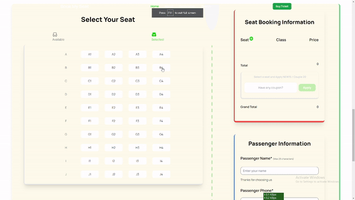
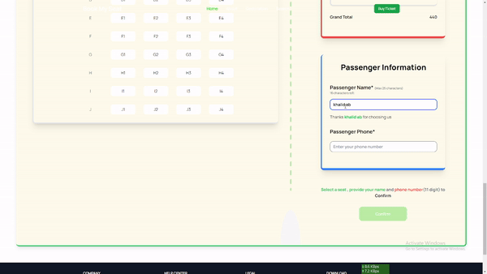
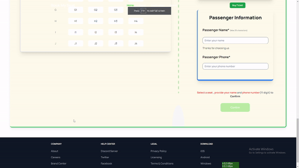

 

# Book My Seat
An online bus ticket booking application developed  using **Tailwind Css** and **Vanila javascript**

# Features
- [Seat reservation](#seat-reservation)
- [Discount Coupon](#discount-coupon) 
- [Passenger Info verification](#passenger-info-verification)
- [Confirmation](#confirmation)

## Seat Reservation
Passenger can select and unselect seats and only book 4 seats at max. Seat information is shown on the right side.

[Back to top](#features)

## Discount Coupon
A passenger can apply discount coupon once he has booked a seat otherwise he won't be able to apply discount coupon.

[Back to top](#features)

## Passenger Info verification
The passenger has to provide his/her name and an 11 digit phone number in order to proceed.

[Back to top](#features)

## Confirmation
Once the passenger has provided his/her informations and booked at least one seat he/she can confirm the booking. After confirmation he can't change his/her preference.

[Back to top](#features)